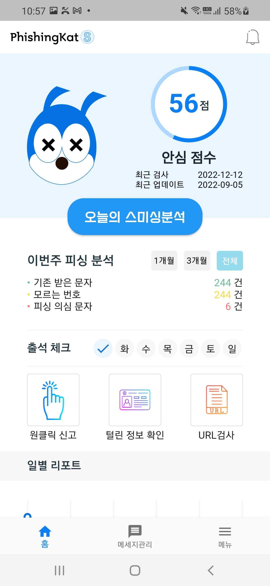
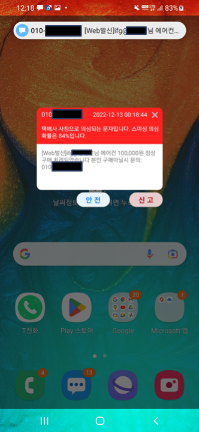
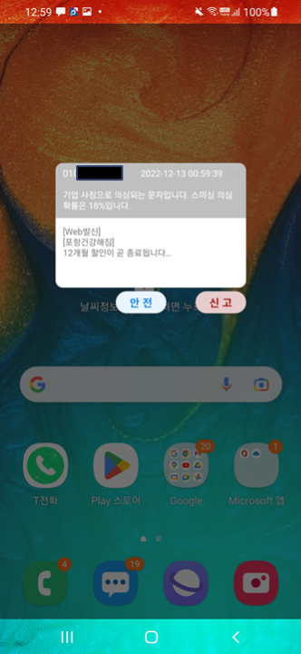

# 피싱캣S 프로젝트

|||
|--------|--------|
|홈 화면|문자관리화면|
 | 
|실시간 문자 탐지 화면1|실시간 문자 탐지 화면2|
  

# 관련 코드
* 회사 보안 서약서에 의해 관련 코드는 비공개입니다.

# 참고 논문 구현 코드
[논문 구현 코드](https://github.com/Jiwon96/papers/tree/main/neural_Attention_Model_for_Aspect_Extraction)
