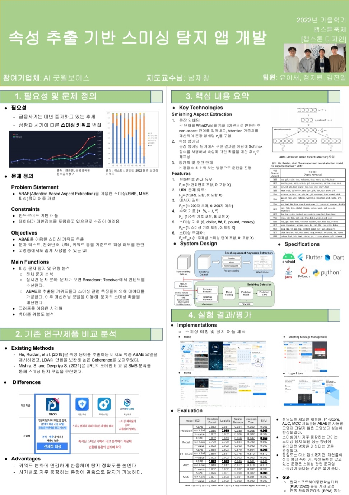

# 피싱캣S 프로젝트
프로젝트 요약
스미싱 피해 방지 어플리케이션
스미싱 범죄의 주 타겟이 되는 20대 여성과 4~50대 장년층의 스미싱 피해를 막기 위한 어플리케이션 개발을 목적으로 한다. 그를 위해서 자연어처리기법(NLP)를 이용하여 실시간 문자탐지로 사기위험이 높은 문자를 분류하고 스미싱 피해를 예방(방지)하는 솔루션을 제공하는 것을 캡스톤의 목표로 한다.

|||
|--------|--------|
|홈 화면|문자관리화면|
 | 
|실시간 문자 탐지 화면1|실시간 문자 탐지 화면2|
  

# 관련 코드
* 회사 보안 서약서에 의해 관련 코드는 비공개입니다.

# 참고 논문 구현 코드
[논문 구현 코드](https://github.com/Jiwon96/papers/tree/main/neural_Attention_Model_for_Aspect_Extraction)
